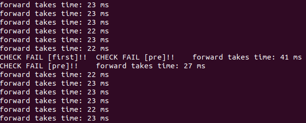

# 代码和模型说明
 1. 代码是在RK提供的官方server代码上修改的，启动后将不停地循环做推理
 2. 运行方法: 代码拷贝到计算棒中。在当前工程路径下`mkdir build`, 在buld文件夹中执行`cmake ..` 和 `make` 后，执行 `./1808_debug ../models/model_name_xxx`
 3. 环境: librknn_runtime version 1.5.1, driver version 10126
 4. models文件夹内提供了用于测试的模型, 模型文件说明：
 
|  模型  |  路径 |
|  ----  | ----  |
| 官方提供的SSD模型  | ` models/ssd/mobilenet_ssd.rknn` |
| LSTM识别模型，使用1.4版本的RKNN toolkit转换的测试模型([模型结构](https://github.com/xmfbit/warpctc-caffe/blob/master/examples/warpctc_captcha/deploy.prototxt) [模型权重](https://drive.google.com/file/d/0B98MUaCGMMG0UVd1WWFrNHZLdTg/view)) | `models/text_rec/caffe_rec_debug-1.4.rknn` |
| LSTM识别模型，使用1.6版本的RKNN toolkit转换的测试模型([模型结构](https://github.com/xmfbit/warpctc-caffe/blob/master/examples/warpctc_captcha/deploy.prototxt) [模型权重](https://drive.google.com/file/d/0B98MUaCGMMG0UVd1WWFrNHZLdTg/view))| `models/text_rec/caffe_rec_debug-1.6.rknn` |

# 验证多模型并行
 1. 运行多个前向实例（进程），观察结果是否出现异常。当运行多个SSD模型时无异常，SSD模型与带LSTM结构的OCR识别模型一起运行，或多个LSTM识别模型同时运行时。带LSTM结构的模型会出现异常: 
 
     
 2. [模型结构](https://github.com/xmfbit/warpctc-caffe/blob/master/examples/warpctc_captcha/deploy.prototxt)中包含两层LSTM结构，如果只有一层LSTM，未发现异常。
 3. 初步观察只有多个模型运行时计算出现overlapping才会发生异常。如果使用一个很小的模型和带LSTM结构的OCR识别模型一起并行，异常结果出现非常频繁，基本每次都有异常。这两个公开模型就可以表现问题，这里就没提供其他测试模型。
 4. 1.4 和 1.6版本的toolkit转换出来的带LSTM结构的模型，表现相同
